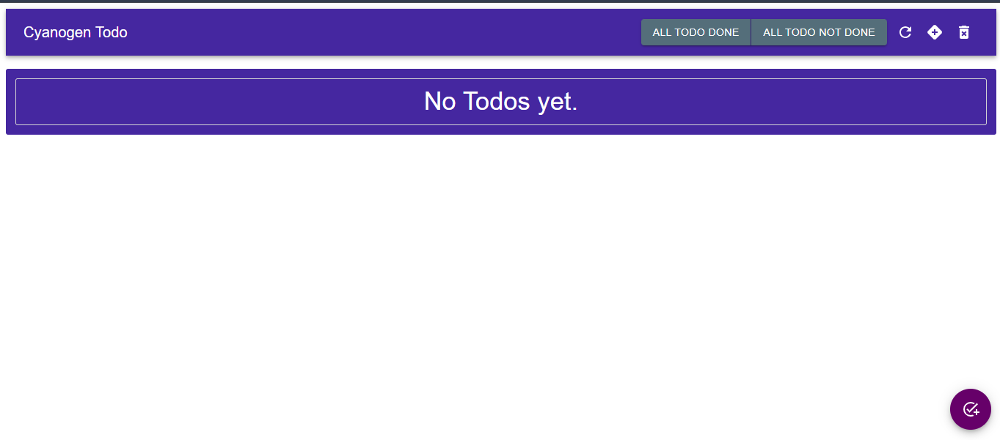
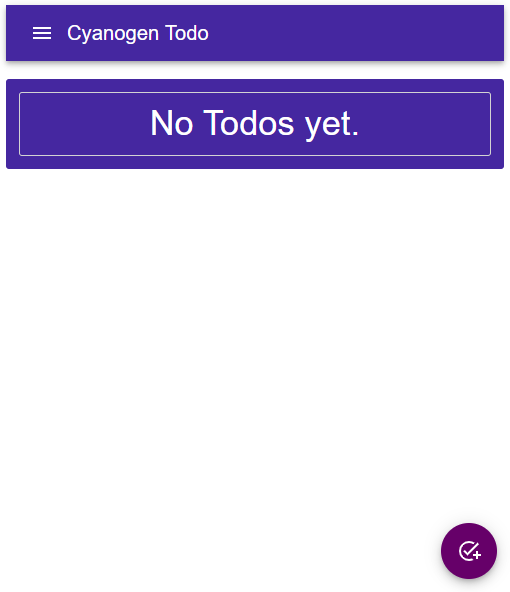
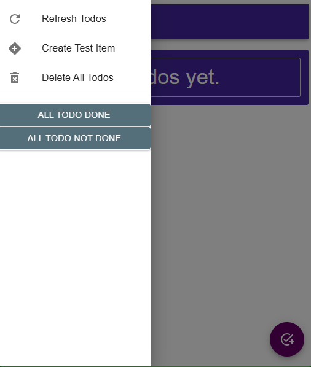

# Cyanogen Todo
#### A Todo Full-Stack Todo Application with MERN Stack


### It is Based On MUI
##### It is my first web app

## Screen Shots of the app

### Desktop


### Mobile 


## Mobile ( Drawer Open )


## It is Build for fast, simple, minimal and responsive design

### Start It as development server
```shell
# Mongodb compass required
# Npm required
# python required
# ------------------------------------------
# First Start Back-end
cd ./back-end
./venv./scripts/activate
py ./main.py
# Then start front end from other terminal window
cd ./front-end
npm run dev
```
